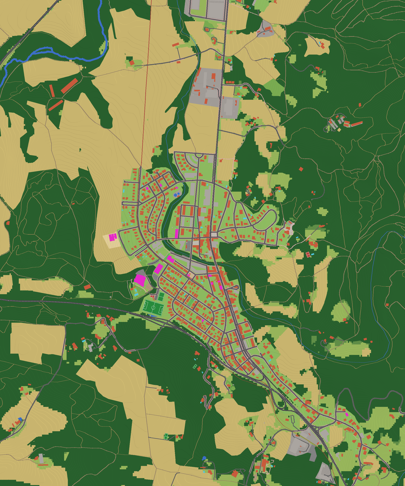

# Quart – mod de Minecraft

Mod de **Fabric para Minecraft 1.21.1** que genera el pueblo de **Quart (Girona)** a **escala real
(1 bloque = 1 metro)** alrededor del punto de aparición. El resto del mundo es Minecraft normal.

- El jugador aparece delante de la **Estació de Quart**.
- La zona del pueblo (unos 2 × 2,4 km, de la Estació a la C-65 y hasta Casa 1 al sureste) usa
  el **relieve real**, las **calles**, las **parcelas**, los **edificios** y los **usos del suelo** reales.
- Alrededor hay una franja de 96 bloques en la que el terreno real se funde con el terreno vanilla.
  Más allá, el mundo es un mundo normal (con la semilla que elijas).
- Dentro del pueblo no se generan aldeas, templos ni minas vanilla, y el bioma es llanura.



## Instalación

1. Instala [Fabric Loader](https://fabricmc.net/use/) para Minecraft **1.21.1** y el
   [Fabric API](https://modrinth.com/mod/fabric-api) (0.116.x+1.21.1).
2. Compila el mod (`./gradlew build`) o descarga el `.jar` y cópialo en la carpeta `mods`.
3. Crea un **mundo nuevo** (tipo "Por defecto"). El pueblo solo aparece en mundos nuevos.

## Qué sale en el mundo

| Elemento | Cómo se genera |
|---|---|
| Relieve | Modelo digital de elevación (EU-DEM/SRTM, ~30 m, suavizado). La Estació (98 m s.n.m.) queda en Y = 72 |
| Calles | OpenStreetMap: calzada gris con líneas discontinuas en la C-250z, aceras con baldosas rosadas y blancas, bordillo y farolas |
| Edificios | 682 plantas de OpenStreetMap + 228 de Microsoft Building Footprints (para cubrir los huecos de OSM en el centro) |
| Alturas | Heurística: casas de 2 plantas, edificios del centro y de la carretera de 3, naves de 1 planta alta |
| Tejados | A cuatro aguas de teja (ladrillo/granito), planos en bloques y naves, bóveda roja en el pabellón |
| Suelo | OSM + ESA WorldCover: bosques (pinos piñoneros y encinas), campos de trigo, prados, jardines, piscinas |
| Deporte | Campo de fútbol Gaudenci Sellés con líneas y porterías, pistas con canastas |
| Via Verda | El antiguo Carrilet Girona–Sant Feliu, en rojo |

### Edificios y lugares destacados (`tools/landmarks.json`)

Estació (spawn, con la locomotora y los bancos de la plaza), Museu de la Terrissa (con la chimenea
de la bòbila), Local social (con la zona de bancos, olivos y escultura), Pavelló, Escola Nou de Quart,
Parc de la Tirolina (tirolina y parque infantil), El teu Súper y las casas 1 a 9 de las fotos.
Cada uno tiene materiales, número de plantas, tejado y una **fachada dibujada a mano** a partir
de Street View (puertas, ventanas con persiana o reja, garajes, balcones con su barandilla, escaparates,
zócalo, alero, tejado a cuatro o a dos aguas, chimenea, porche y el muro de la parcela con sus paneles).

Entre la escuela/Local social y el Museu de la Terrissa hay un **parque con bancos**: camino de tierra,
árboles a los dos lados, bancos mirando al camino, postes de madera en la entrada y una farola.

## Limitaciones (importante)

- **Las casas se parecen a las reales, pero no son copias exactas.** Street View solo muestra la
  fachada de la calle y a 1 bloque = 1 m no caben detalles de menos de un metro. La parte trasera,
  los patios y el interior son genéricos.
- **Alturas aproximadas.** No he podido descargar datos con la altura real de cada edificio: el
  Catastro y el ICGC bloquean la conexión desde el servidor donde se ha hecho el mod. Si los
  descargas tú (ver abajo), el pipeline puede usarlos.
- El modelo de elevación es de ~30 m, así que los desniveles pequeños (un muro, un talud) no salen.
- Las casas 2, 8, 9 y El teu Súper no están en OpenStreetMap: su planta es un rectángulo
  colocado delante de la cámara de Street View, con las medidas estimadas a partir de las fotos.
- Bajo el pueblo **no hay minerales** (las features vanilla se desactivan en esa zona para que no
  salgan árboles ni lagos en medio de las calles). Las cuevas sí se generan.

## Cómo mejorar la precisión

Todo el pueblo sale de `tools/build_town.py`, que lee `tools/data/` y `tools/landmarks.json` y
escribe `src/main/resources/data/quartmod/town/`.

```bash
pip install numpy scipy shapely pillow
python3 tools/build_town.py        # regenera los datos y docs/preview.png
./gradlew build                    # compila el mod
```

- **Datos oficiales:** descarga desde tu ordenador la *Referència Topogràfica Territorial* del
  ICGC en GeoPackage 3D (edificios con altura) o los edificios del Catastro INSPIRE del municipio
  17151 (Quart) y pásamelos. Con eso las alturas y las plantas serán exactas.
- **Más casas destacadas:** añade una entrada a `tools/landmarks.json` con el punto (o la cámara
  de Street View), materiales y la fachada.

## Estructura

```
src/main/java/cat/quart/mod/
  QuartMod.java              inicialización
  town/TownData.java         carga el ráster del pueblo
  town/TownGenerator.java    terreno, suelo, muros de parcela, farolas
  town/Buildings.java        paredes, ventanas, fachadas, pisos, tejados
  town/Trees.java            árboles mediterráneos
  town/Decorations.java      locomotora, chimenea, bancos, tirolina, porterías...
  mixin/                     enganches con la generación de mundo de Minecraft
tools/
  build_town.py              datos reales -> ráster del mod
  landmarks.json             edificios destacados
  render_world.py            dibuja un mundo generado visto desde arriba (para comprobar)
  iso_render.py              vista isométrica de una zona del mundo generado
  elevation.py               fachada vista de frente (para comparar con Street View)
  data/                      datos de origen
docs/
  preview.png                vista previa del ráster
  referencias/               tus fotos de Google Maps / Street View
```

## Créditos de los datos

- © [OpenStreetMap](https://www.openstreetmap.org/copyright) contributors (ODbL)
- [Microsoft Global ML Building Footprints](https://github.com/microsoft/GlobalMLBuildingFootprints) (ODbL)
- [ESA WorldCover 2021](https://esa-worldcover.org) (CC BY 4.0)
- [AWS Terrain Tiles](https://registry.opendata.aws/terrain-tiles/) (EU-DEM, SRTM)
